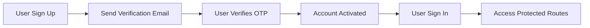

<div align="center">
  
  
  
  # 🔮 Mystery Message
  
  ### *Send and receive anonymous messages with style*
  
  
  
  
  
  
  
  [Features](#features) • [Installation](#installation) • [Usage](#usage) • [API](#api-routes) • [Contributing](#contributing)
  
</div>

---

## 📖 About

A Next.js application for anonymous messaging with user authentication and email verification.

## ✨ Features

- 🔐 **Secure Authentication** - NextAuth.js powered authentication
- ✉️ **Email Verification** - OTP-based email verification system
- 💬 **Anonymous Messaging** - Send and receive messages anonymously
- 🗄️ **MongoDB Integration** - Robust database with Mongoose ODM
- 🎨 **Modern UI** - Responsive design with Tailwind CSS
- 🛡️ **Type Safety** - Full TypeScript support with Zod validation
- 🚀 **CI/CD Pipeline** - Automated testing and deployment with GitHub Actions

## 🛠️ Tech Stack

<table>
  <tr>
    <td align="center" width="96">
      
      <br>Next.js
    </td>
    <td align="center" width="96">
      
      <br>TypeScript
    </td>
    <td align="center" width="96">
      
      <br>MongoDB
    </td>
    <td align="center" width="96">
      
      <br>Tailwind CSS
    </td>
    <td align="center" width="96">
      
      <br>Node.js
    </td>
  </tr>
</table>

- **Framework:** Next.js 15.5.5 (App Router with Turbopack)
- **Authentication:** NextAuth.js v4
- **Database:** MongoDB with Mongoose ODM
- **Email Service:** Resend
- **Validation:** Zod Schema Validation
- **Styling:** Tailwind CSS v4
- **Language:** TypeScript 5
- **CI/CD:** GitHub Actions

## 🚀 Getting Started

### 📋 Prerequisites

- Node.js 18+ installed
- MongoDB database (local or Atlas)
- Resend account for email sending

### 📦 Installation

1. Clone the repository:
```bash
git clone <your-repo-url>
cd mystrymess
```

2. Install dependencies:
```bash
npm install
```

3. Create a `.env` file in the root directory:
```env
MONGODB_URI=your_mongodb_connection_string
NEXTAUTH_SECRET=your_nextauth_secret
NEXTAUTH_URL=http://localhost:3000
RESEND_API_KEY=your_resend_api_key
```

4. Run the development server:
```bash
npm run dev
```

5. Open [http://localhost:3000](http://localhost:3000) in your browser.

## 📁 Project Structure

```
src/
├── app/
│   ├── (auth)/
│   │   └── sign-in/          # Sign-in page
│   ├── api/
│   │   ├── auth/
│   │   │   └── [...nextauth]/ # NextAuth configuration
│   │   └── sign-up/           # Sign-up API route
│   ├── layout.tsx             # Root layout
│   └── page.tsx               # Home page
├── context/
│   └── AuthProvider.tsx       # NextAuth session provider
├── helper/
│   └── sendVerificationEmail.ts # Email sending helper
├── lib/
│   ├── dbConnect.ts           # MongoDB connection
│   └── resend.ts              # Resend configuration
├── Model/
│   └── User.ts                # User model
├── schemas/
│   ├── SigninSchema.ts        # Sign-in validation
│   ├── SignupSchema.ts        # Sign-up validation
│   └── verifySchema.ts        # Verification validation
├── types/
│   ├── ApiResponse.ts         # API response types
│   ├── next-auth.d.ts         # NextAuth type extensions
│   └── decls.d.ts             # Module declarations
└── middleware.ts              # Route protection middleware
```

## 🔌 API Routes

| Method | Endpoint | Description |
|--------|----------|-------------|
| `POST` | `/api/sign-up` | User registration with email verification |
| `POST` | `/api/auth/[...nextauth]` | NextAuth authentication (sign-in) |
| `GET` | `/api/auth/[...nextauth]` | Get current session |

## 🔐 Environment Variables

| Variable | Description |
|----------|-------------|
| `MONGODB_URI` | MongoDB connection string |
| `NEXTAUTH_SECRET` | Secret for NextAuth.js |
| `NEXTAUTH_URL` | Application URL |
| `RESEND_API_KEY` | Resend API key for emails |

## 🔄 Authentication Flow



1. 📝 User signs up with username, email, and password
2. 📧 System sends verification email with OTP
3. ✅ User verifies email with OTP
4. 🔓 User can sign in with verified credentials
5. 🛡️ Protected routes require authentication

## 🤖 CI/CD Workflow

This project uses GitHub Actions for continuous integration and deployment:

### Workflow Jobs

- **Lint** - Runs ESLint to check code quality
- **Type Check** - Validates TypeScript types
- **Build** - Builds the Next.js application

### Setting up GitHub Secrets

Add these secrets to your GitHub repository:

1. Go to `Settings` → `Secrets and variables` → `Actions`
2. Add the following secrets:
   - `MONGODB_URI`
   - `NEXTAUTH_SECRET`
   - `NEXTAUTH_URL`
   - `RESEND_API_KEY`

### Workflow Triggers

- Push to `main` or `master` branch
- Pull requests to `main` or `master` branch

## Contributing

Contributions are welcome! Please feel free to submit a Pull Request.

## License

This project is open source and available under the MIT License.
