<div align="center">
  
  
  
  # 🔮 Mystery Message
  
  ### *Send and receive anonymous messages with style*
  
  <p align="center">
    
    
    
    
  </p>
  
  <p align="center">
    
    
    
    
    
  </p>
  
  <p align="center">
    <a href="#-features">Features</a> •
    <a href="#-getting-started">Getting Started</a> •
    <a href="#-tech-stack">Tech Stack</a> •
    <a href="#-authentication-flow">Auth Flow</a> •
    <a href="#-api-routes">API</a> •
    <a href="#-cicd-workflow">CI/CD</a>
  </p>
  
</div>

<br/>

<div align="center">
  
</div>

---

## 📖 About

A modern, secure Next.js platform for anonymous messaging featuring enterprise-grade authentication, real-time email verification, and a sleek UI powered by the latest web technologies. Built with NextAuth.js for authentication, Zod for bulletproof schema validation, and Framer Motion for smooth animations.

## ✨ Features

<table>
<tr>
<td width="50%">

### 🔐 Authentication & Security
- **NextAuth.js v4** - Industry-standard authentication
- **OTP Email Verification** - Secure account activation
- **Zod Schema Validation** - Runtime type safety
- **Protected Routes** - Middleware-based route protection
- **Encrypted Passwords** - bcryptjs hashing

</td>
<td width="50%">

### 🎨 User Experience
- **Framer Motion** - Smooth, fluid animations
- **Tailwind CSS v4** - Modern, responsive design
- **Anonymous Messaging** - Privacy-first communication
- **Real-time Feedback** - Instant validation & responses
- **Mobile Optimized** - Works seamlessly on all devices

</td>
</tr>
<tr>
<td width="50%">

### 🚀 Performance & Scale
- **Next.js 15.5.5** - App Router with Turbopack
- **MongoDB + Mongoose** - Scalable NoSQL database
- **Server Components** - Optimized rendering
- **API Routes** - RESTful backend endpoints
- **TypeScript 5** - Full type safety

</td>
<td width="50%">

### 🛠️ Developer Experience
- **CI/CD Pipeline** - GitHub Actions automation
- **ESLint** - Code quality enforcement
- **Type Checking** - Compile-time error detection
- **Hot Reload** - Instant development feedback
- **Modular Architecture** - Clean, maintainable code

</td>
</tr>
</table>

## 🛠️ Tech Stack

<div align="center">

<table>
  <tr>
    <td align="center" width="96">
      
      <br><strong>Next.js</strong>
      <br><sub>15.5.5</sub>
    </td>
    <td align="center" width="96">
      
      <br><strong>TypeScript</strong>
      <br><sub>5.0</sub>
    </td>
    <td align="center" width="96">
      
      <br><strong>MongoDB</strong>
      <br><sub>8.19.1</sub>
    </td>
    <td align="center" width="96">
      
      <br><strong>Tailwind</strong>
      <br><sub>v4</sub>
    </td>
    <td align="center" width="96">
      
      <br><strong>Node.js</strong>
      <br><sub>18+</sub>
    </td>
  </tr>
</table>

</div>

### Core Technologies

| Category | Technology | Purpose |
|----------|-----------|---------|
| **Framework** | Next.js 15.5.5 | App Router with Turbopack for blazing-fast builds |
| **Authentication** | NextAuth.js v4 | Secure, flexible authentication solution |
| **Database** | MongoDB + Mongoose | Scalable NoSQL database with elegant ODM |
| **Email Service** | Resend | Modern email API for transactional emails |
| **Validation** | Zod 4.1.12 | TypeScript-first schema validation |
| **Styling** | Tailwind CSS v4 | Utility-first CSS framework |
| **Animations** | Framer Motion 12.23.24 | Production-ready motion library |
| **Language** | TypeScript 5 | Type-safe JavaScript superset |
| **CI/CD** | GitHub Actions | Automated testing and deployment |

## 🚀 Getting Started

### 📋 Prerequisites

- Node.js 18+ installed
- MongoDB database (local or Atlas)
- Resend account for email sending

### 📦 Installation

1. Clone the repository:
```bash
git clone <your-repo-url>
cd mystrymess
```

2. Install dependencies:
```bash
npm install
```

3. Create a `.env` file in the root directory:
```env
MONGODB_URI=your_mongodb_connection_string
NEXTAUTH_SECRET=your_nextauth_secret
NEXTAUTH_URL=http://localhost:3000
RESEND_API_KEY=your_resend_api_key
```

4. Run the development server:
```bash
npm run dev
```

5. Open [http://localhost:3000](http://localhost:3000) in your browser.

## 📁 Project Structure

```
src/
├── app/
│   ├── (auth)/
│   │   └── sign-in/          # Sign-in page
│   ├── api/
│   │   ├── auth/
│   │   │   └── [...nextauth]/ # NextAuth configuration
│   │   └── sign-up/           # Sign-up API route
│   ├── layout.tsx             # Root layout
│   └── page.tsx               # Home page
├── context/
│   └── AuthProvider.tsx       # NextAuth session provider
├── helper/
│   └── sendVerificationEmail.ts # Email sending helper
├── lib/
│   ├── dbConnect.ts           # MongoDB connection
│   └── resend.ts              # Resend configuration
├── Model/
│   └── User.ts                # User model
├── schemas/
│   ├── SigninSchema.ts        # Sign-in validation
│   ├── SignupSchema.ts        # Sign-up validation
│   └── verifySchema.ts        # Verification validation
├── types/
│   ├── ApiResponse.ts         # API response types
│   ├── next-auth.d.ts         # NextAuth type extensions
│   └── decls.d.ts             # Module declarations
└── middleware.ts              # Route protection middleware
```

## 🔌 API Routes

| Method | Endpoint | Description |
|--------|----------|-------------|
| `POST` | `/api/sign-up` | User registration with email verification |
| `POST` | `/api/auth/[...nextauth]` | NextAuth authentication (sign-in) |
| `GET` | `/api/auth/[...nextauth]` | Get current session |

## 🔐 Environment Variables

| Variable | Description |
|----------|-------------|
| `MONGODB_URI` | MongoDB connection string |
| `NEXTAUTH_SECRET` | Secret for NextAuth.js |
| `NEXTAUTH_URL` | Application URL |
| `RESEND_API_KEY` | Resend API key for emails |

## 🔄 Authentication Flow

```mermaid
%%{init: {'theme':'dark', 'themeVariables': { 'primaryColor':'#7C3AED','primaryTextColor':'#fff','primaryBorderColor':'#A78BFA','lineColor':'#8B5CF6','secondaryColor':'#1F2937','tertiaryColor':'#111827'}}}%%
graph TB
    A[👤 User Sign Up] -->|Submit Form| B{Zod Validation}
    B -->|✅ Valid| C[💾 Store in MongoDB]
    B -->|❌ Invalid| A
    C -->|Generate OTP| D[📧 Send Email via Resend]
    D --> E[⏳ Awaiting Verification]
    E -->|Enter OTP| F{Verify OTP}
    F -->|✅ Correct| G[🎉 Account Activated]
    F -->|❌ Incorrect| E
    G --> H[🔐 User Sign In]
    H -->|NextAuth.js| I{Credentials Check}
    I -->|✅ Valid| J[🔓 Session Created]
    I -->|❌ Invalid| H
    J --> K[🛡️ Access Protected Routes]
    K -->|Middleware| L[✨ Full App Access]
    
    style A fill:#7C3AED,stroke:#A78BFA,stroke-width:2px,color:#fff
    style G fill:#10B981,stroke:#34D399,stroke-width:2px,color:#fff
    style J fill:#3B82F6,stroke:#60A5FA,stroke-width:2px,color:#fff
    style L fill:#8B5CF6,stroke:#A78BFA,stroke-width:2px,color:#fff
```

<div align="center">



</div>

### Step-by-Step Process

<table>
<tr>
<td width="10%" align="center">📝</td>
<td width="90%"><strong>Registration</strong><br/>User submits username, email, and password. Zod validates the schema in real-time.</td>
</tr>
<tr>
<td width="10%" align="center">💾</td>
<td width="90%"><strong>Data Storage</strong><br/>Credentials are hashed with bcryptjs and stored in MongoDB via Mongoose.</td>
</tr>
<tr>
<td width="10%" align="center">📧</td>
<td width="90%"><strong>Email Verification</strong><br/>System generates a 6-digit OTP and sends it via Resend email service.</td>
</tr>
<tr>
<td width="10%" align="center">✅</td>
<td width="90%"><strong>OTP Verification</strong><br/>User enters OTP code to activate their account.</td>
</tr>
<tr>
<td width="10%" align="center">🔐</td>
<td width="90%"><strong>Authentication</strong><br/>User signs in with verified credentials through NextAuth.js.</td>
</tr>
<tr>
<td width="10%" align="center">🛡️</td>
<td width="90%"><strong>Protected Access</strong><br/>Middleware validates session tokens for protected routes.</td>
</tr>
</table>

## 🤖 CI/CD Workflow

```mermaid
%%{init: {'theme':'dark', 'themeVariables': { 'primaryColor':'#2563EB','primaryTextColor':'#fff','primaryBorderColor':'#60A5FA','lineColor':'#3B82F6','secondaryColor':'#1F2937','tertiaryColor':'#111827'}}}%%
graph LR
    A[📝 Code Push] --> B[🔄 GitHub Actions]
    B --> C[🔍 ESLint Check]
    B --> D[📘 Type Check]
    B --> E[🏗️ Build]
    C --> F{All Passed?}
    D --> F
    E --> F
    F -->|✅ Yes| G[🚀 Deploy Ready]
    F -->|❌ No| H[🔴 Build Failed]
    G --> I[✨ Production]
    
    style A fill:#2563EB,stroke:#60A5FA,stroke-width:2px,color:#fff
    style G fill:#10B981,stroke:#34D399,stroke-width:2px,color:#fff
    style H fill:#EF4444,stroke:#F87171,stroke-width:2px,color:#fff
    style I fill:#8B5CF6,stroke:#A78BFA,stroke-width:2px,color:#fff
```

<div align="center">



</div>

### Automated Pipeline

This project uses **GitHub Actions** for continuous integration and deployment with three parallel jobs:

<table>
<tr>
<td width="33%" align="center">
<h4>🔍 Lint</h4>
<p>Runs ESLint to enforce code quality standards and catch potential issues</p>
</td>
<td width="33%" align="center">
<h4>📘 Type Check</h4>
<p>Validates TypeScript types across the entire codebase for type safety</p>
</td>
<td width="33%" align="center">
<h4>🏗️ Build</h4>
<p>Compiles the Next.js application with Turbopack to ensure production readiness</p>
</td>
</tr>
</table>

### Setting up GitHub Secrets

Configure these environment secrets in your repository:

1. Navigate to `Settings` → `Secrets and variables` → `Actions`
2. Add the following repository secrets:

| Secret Name | Description |
|------------|-------------|
| `MONGODB_URI` | MongoDB connection string |
| `NEXTAUTH_SECRET` | Secret key for NextAuth.js |
| `NEXTAUTH_URL` | Application URL (production) |
| `RESEND_API_KEY` | Resend API key for emails |

### Workflow Triggers

- ✅ Push to `main` or `master` branch
- ✅ Pull requests targeting `main` or `master`
- ✅ Manual workflow dispatch

---

<div align="center">

## 🤝 Contributing

Contributions, issues, and feature requests are welcome!

Feel free to check the [issues page](../../issues) and submit a PR.

<br/>

## 📄 License

This project is licensed under the **MIT License** - see the [LICENSE](LICENSE) file for details.

<br/>

## 🌟 Show Your Support

Give a ⭐️ if this project helped you!

<br/>


<br/>

**Built with 💜 using Next.js, NextAuth.js, Zod, and Framer Motion**

</div>
